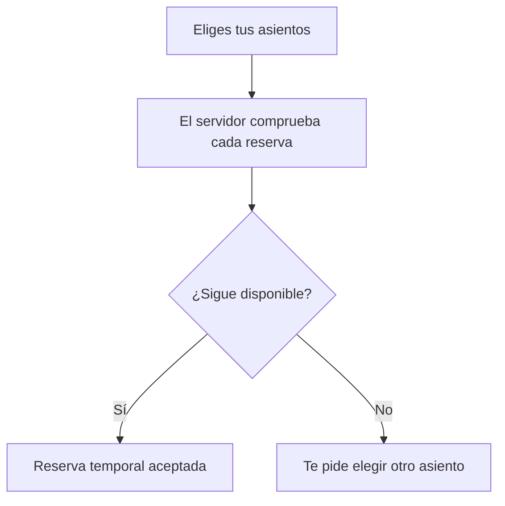

# MegaTicketing

Una forma clara de encontrar un evento, elegir asientos y solicitar una reserva. La pantalla consulta la disponibilidad real y muestra cuánto suman los asientos elegidos. Cada reserva se confirma con el servidor del organizador.

[Ver comprobaciones](https://github.com/genesisgzdev/Project-MegaTicketing/actions) · [Guía de uso](docs/USO.md) · [Preparar la instalación](docs/DEPLOYMENT_PREFLIGHT.md)

## Si vas a un evento

Abre la web que te facilite el organizador. No necesitas instalar este repositorio para usar una web ya publicada.

1. Elige el evento
2. Busca un asiento o muestra solo los disponibles
3. Revisa tu selección y el importe
4. Conecta el acceso que te haya facilitado el organizador
5. Pulsa **Reservar selección** y revisa el resultado de cada asiento

La reserva es temporal. La confirmación de reserva no equivale a una entrada pagada. Esta pantalla no cobra ni emite entradas; el organizador debe integrar el flujo de pago y entrega correspondiente.

| Estado del asiento | Qué significa |
| --- | --- |
| Disponible | Puedes solicitarlo |
| Elegido | Lo has añadido a tu selección, pero aún no está apartado |
| En reserva | Está temporalmente apartado |
| Vendido | El servidor lo marca como pagado |

Los asientos se muestran como una lista visual, no como un plano físico del recinto. Los estados tienen nombres además de colores y la selección puede hacerse con teclado.



## Si organizas eventos

Este repositorio contiene la web y el servidor. Necesitas publicar tus eventos y usuarios en la base de datos, configurar el acceso y conectar tu flujo de pago. No se crean eventos ficticios ni compradores de ejemplo al arrancar.

La configuración de instalación se explica en [Preparar la instalación](docs/DEPLOYMENT_PREFLIGHT.md). El catálogo público permite consultar eventos sin acceso. Reservar necesita una identidad válida proporcionada por el organizador; esta versión no incluye registro de cuentas ni recuperación de contraseñas.

## Levantar el proyecto en tu equipo

Necesitas Docker con Compose. Desde la carpeta del proyecto:

```sh
cp .env.example .env
```

En Windows puedes usar `Copy-Item .env.example .env`. Completa los valores de base de datos, Stripe y acceso indicados en el archivo. Los textos de ejemplo no son credenciales válidas.

```sh
docker compose up --build
```

Abre **http://localhost** cuando los servicios hayan arrancado. Compose prepara la base y aplica las migraciones antes de iniciar la API. Para una base existente, sigue primero la [guía de migración](docs/DEPLOYMENT_PREFLIGHT.md); no inicialices tablas sobre datos existentes sin comprobar su estado.

Si no has publicado eventos, verás un estado vacío explicado. Una instalación con errores muestra el problema y permite volver a consultar.

## Para trabajar en el código

Usa Node.js 22 y npm 10.8.2. Con la configuración y los servicios necesarios preparados:

```sh
npm ci --ignore-scripts
npm run db:generate
npm run build
npm test
npm run test:api
```

Las pruebas de integración usan PostgreSQL y Redis reales. `npm run test:api:integration` requiere una base de pruebas migrada y sus variables de entorno. No lo ejecutes contra datos de producción.

La [guía](docs/USO.md) explica el comportamiento de reservas y errores. La [arquitectura](docs/ARCHITECTURE.md) y el [mapa de archivos](docs/REPOSITORY_MAP.md) permiten seguir el código cuando lo necesites.

Licencia [MIT](LICENSE).
