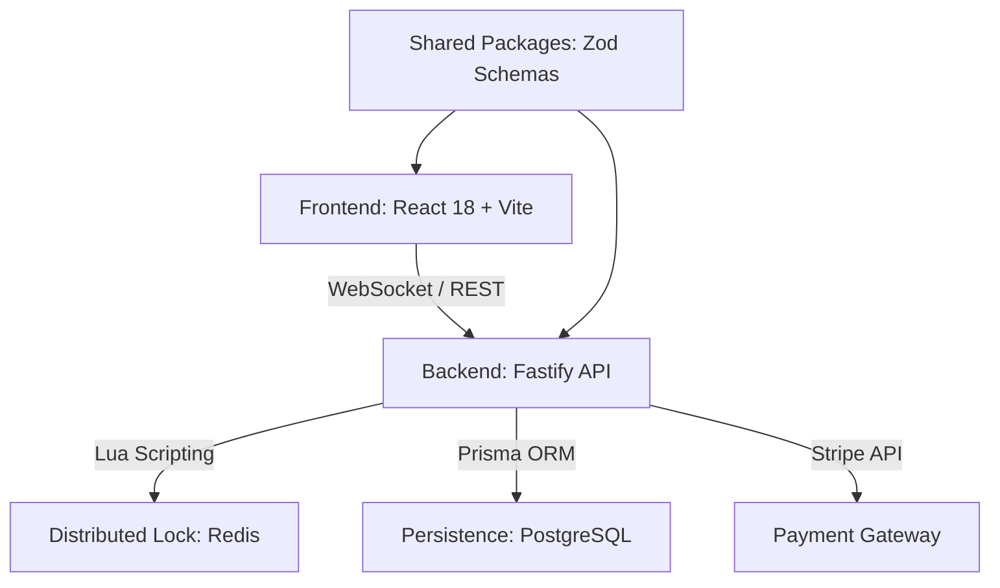

# 🏟️ Project MegaTicketing
> **High-Performance Industrial Ticketing Suite & Real-Time Logistics Monorepo**

[](https://app.snyk.io/org/genesisgzdev)
[](docs/ARCHITECTURE.md)
[](https://github.com/genesisgzdev/Project-MegaTicketing)
[](LICENSE)
[](https://github.com/genesisgzdev/Project-MegaTicketing/actions/workflows/security.yml)

---

## 📖 Table of Contents
- [Executive Summary](#-executive-summary)
- [System Architecture](#-system-architecture)
- [Key Engineering Pillars](#-key-features--engineering-pillars)
- [Tech Stack & Tooling](#-tech-stack--tooling)
- [Security Hardening](#-security-hardening--integrity)
- [Infrastructure & Deployment](#-infrastructure--deployment)
- [Local Development](#-local-development)
- [Roadmap](#-roadmap)
- [Known Limitations](#-known-limitations)

---

## 🎯 Executive Summary
**Project MegaTicketing** is an enterprise-grade ticketing and seat management ecosystem designed for high-concurrency environments. This monorepo implements a **Distributed Locking Pattern** via Redis Lua scripting to handle millions of simultaneous reservation attempts with zero-overbooking guarantees and sub-millisecond consistency.

---

## 🏗 System Architecture
The repository follows a modern **Monorepo** structure managed by **Turbo**, ensuring atomic deployments and optimized build pipelines.



### Modules Breakdown:
- **`apps/api`**: High-performance backend built with **Fastify** and **TypeScript**.
- **`apps/web`**: Futuristic UI with Framer Motion, Tailwind CSS, and React Three Fiber for 3D seat mapping.
- **`packages/database`**: Centralized data layer with Prisma Client.
- **`packages/shared`**: Immutable type definitions and Zod validation schemas.

---

## 🚀 Key Features & Engineering Pillars

### 1. Atomic Transactionality (Redis + Lua)
We utilize custom Lua scripts executed directly within the Redis engine to ensure that the "Check-then-Set" logic for seat availability is truly atomic across distributed instances.

### 2. High-Availability (HA) Design
- **Stateless API Instances**: Scalable horizontally via Docker.
- **Load Balancing**: Integrated Nginx gateway for traffic distribution across API replicas.
- **WebSocket Synchronization**: Live broadcast of seat status updates to all connected clients.

---

## 🛠 Tech Stack & Tooling

- **Backend**: Fastify 5.x, WebSockets, Prisma, Redis, Stripe API.
- **Frontend**: React 18, Vite 5, Tailwind CSS 3, Framer Motion.
- **Database**: PostgreSQL (Production), SQLite (Development).
- **Quality**: Zod, Snyk, Autocannon, Playwright.

---

## 🔐 Security Hardening & Integrity

- **Cryptographic Standards**: JWT implementation using **`jose`** for robust JWS/JWE handling.
- **Rate Limiting**: Sliding-window rate limiting via `@fastify/rate-limit`.
- **Environment Strictness**: Boot-time validation of environment variables via Zod.
- **SAST/SCA**: Integrated **Snyk** auditing in the development lifecycle via Git Hooks and CI/CD.

---

## 🐳 Infrastructure & Deployment

### Docker Orchestration
The project includes a production-ready `docker-compose.yml` with:
- PostgreSQL persistence.
- Redis with health checks.
- Scaled API replicas (3x).
- Nginx Gateway as a Load Balancer.
- Frontend Web service.

```bash
# Start the full stack
docker compose up -d
```

### Cloud Infrastructure (Terraform)
Located in [`infra/`](./infra/), the Terraform plans provision:
- **GKE (Google Kubernetes Engine)** cluster.
- Managed Node Pools with auto-scaling.
- Workload Identity for secure GCP resource access.

Variables required: `project_id`, `region`.

---

## 🚦 Local Development

### Setup
1. **Clone and Configure**:
   ```bash
   git clone https://github.com/genesisgzdev/Project-MegaTicketing.git
   cd Project-MegaTicketing
   cp .env.example .env # Configure your secrets
   npm install --legacy-peer-deps
   ```

2. **Initialize Database**:
   ```bash
   npm run db:generate --prefix packages/database
   npx prisma db push --schema packages/database/prisma/schema.prisma
   ```

3. **Launch**:
   ```bash
   npm run dev
   ```

---

## 🗺 Roadmap
- [ ] Implement Distributed Tracing with OpenTelemetry.
- [ ] Add support for Multi-Region Database Replication.
- [ ] Integration with Google Cloud Pub/Sub for asynchronous order processing.
- [ ] Advanced Fraud Detection module.

---

## ⚠️ Known Limitations
- **Memory Usage**: High concurrency seat maps in React Three Fiber may be resource-intensive on low-end devices.
- **Stripe Webhooks**: Requires a local tunnel (e.g., Cloudflare Tunnel or ngrok) for local development testing.
- **Database**: Development environment defaults to SQLite for simplicity; PostgreSQL is mandatory for production replicas.

---
*Developed with technical integrity and anti-evasion mindset. No simulations.*
