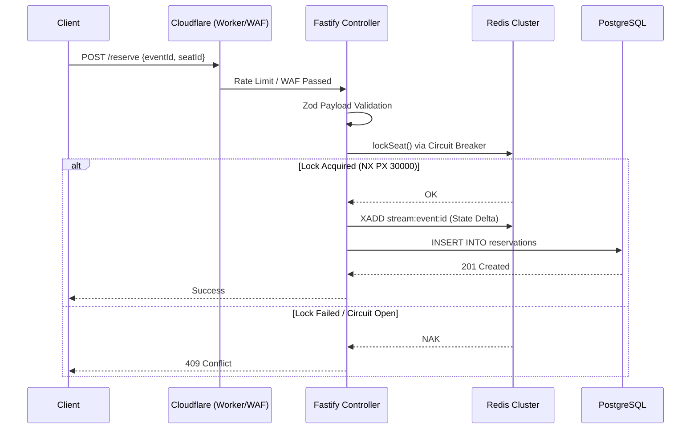

# MegaTicketing Platform

## System Architecture

MegaTicketing is a high-availability, distributed ticketing platform engineered for flash-sale concurrency. The microservices architecture guarantees transactional atomic consistency and zero-overselling through Redis Lua locking, event-driven state reconciliation, and multi-layered perimeter defense.

## Concurrency Control & State Management

### 1. Redis Circuit Breaker & Exponential Backoff
The backend implements a custom `RedisCircuitBreaker` in TypeScript to prevent cascading failures if the cache cluster degrades.
- **State Machine**: Transitions dynamically between `CLOSED`, `OPEN`, and `HALF_OPEN`.
- **Threshold**: Trips to `OPEN` after a predefined number of consecutive connection or timeout failures (e.g., 3).
- **Backoff Algorithm**: Retries implement an exponential backoff timing model (`baseDelay * Math.pow(2, attempt - 1)`).
- **Graceful Degradation**: If Redis is unreachable, the system executes a fallback closure, relying exclusively on PostgreSQL optimistic concurrency control to process the transaction.

### 2. Distributed Atomic Locking (Lua)
Preventing Time-Of-Check to Time-Of-Use (TOCTOU) race conditions during seat reservations is handled entirely within the Redis engine.
- A lock is assigned a UUID token tied to the user session (`SET key value NX PX 30000`).
- **`releaseLockAtomic`**: A registered Lua script ensures that a `DEL` operation only executes if a preceding `GET` matches the user's token. This guarantees that a slow client cannot accidentally release a lock that has expired and been re-acquired by another user.

### 3. Real-time State Reconciliation (Redis Streams)
To synchronize the frontend UI (the 400-node Seat Map Grid) without aggressive polling, the system uses a reactive topology.
- **`XREAD BLOCK`**: Services publish state-change events (e.g., `status: 'RESERVED'`) to Redis Streams (`XADD`). Dedicated routines consume these streams using `XREAD BLOCK`, ensuring ordered, at-least-once delivery with minimal CPU overhead.
- **WebSockets**: Upon consuming a stream event, the Fastify WebSocket gateway broadcasts the delta to connected clients.

## Application Layer

### Fastify & Zod
- **Controller/Service Pattern**: Controllers act purely as the transport layer (HTTP parsing, routing, response formatting). Services encapsulate all protocol-agnostic business logic.
- **Strict Validation**: All inbound payloads, including webhook signatures, are strictly validated against Zod schemas. Deviations return a 400 Bad Request.
- **Rate Limiting**: `@fastify/rate-limit` enforces a strict 100 requests/minute limit per IP, actively defending against brute-force enumeration.

### React Component Memoization
The frontend heavily utilizes `React.memo`, `useMemo`, and `useCallback`.
- Complex hierarchies like the `SystemMonitor.tsx` (Three.js/Cannon.js physics engine) and `CyberArena.tsx` prevent unnecessary re-renders when the WebSocket pushes high-frequency state updates.

## Deployment Topology
- **Multi-Stage Docker**: Images are built using Alpine Linux. The builder stage resolves dependencies (`npm ci --ignore-scripts`), compiles TypeScript, and generates the Prisma client. The final runner stage copies only `/dist`, drops development dependencies (`--omit=dev`), and runs the node process as an unprivileged user (`USER node`).
- **Kubernetes**: Deployments enforce strict CPU (`1000m`) and Memory (`1Gi`) limits. PostgreSQL uses Hash Partitioning on `event_id` to prevent lock contention on B-Tree indexes.
