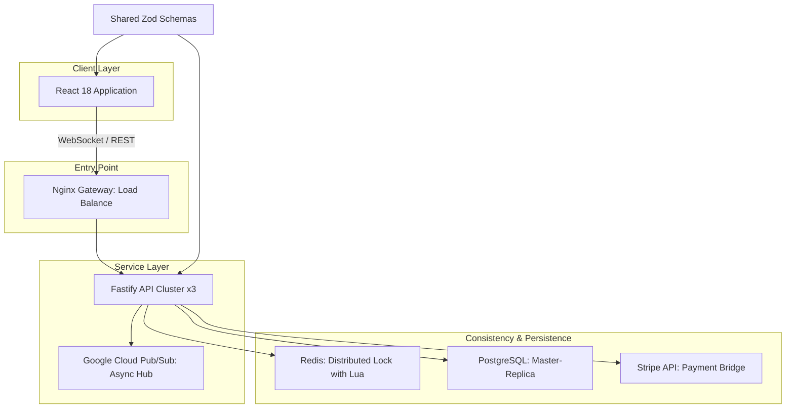

# MegaTicketing - v1.10.0 (April 2026)

Industrial monorepo for high-concurrency event ticketing and real-time seat management. Designed for distributed consistency, horizontal scalability, and deep security instrumentation.

## Architectural Blueprint

The monorepo follows a shared-nothing backend design orchestrated by **Turbo**, ensuring atomic deployments and consistent type definitions across all microservices.



## Engineering Pillars

### 1. Distributed Consistency (Redis + Lua)
To prevent seat overbooking in extreme traffic spikes, MegaTicketing utilizes **Atomic Lua Scripts** executed within the Redis engine.
- **Lock-on-Intent**: Every reservation attempt is validated via a "Check-and-Set" Lua script, ensuring the operation is truly atomic across distributed API replicas.
- **Automatic Expiration**: TTL-based locks ensure orphaned sessions release resources without manual intervention.

### 2. Microservices Orchestration
- **Fastify API**: Optimized for ultra-low overhead, handling thousands of concurrent WebSocket connections for real-time seat updates.
- **Prisma Data Layer**: Provides a type-safe interface to PostgreSQL, with automated migration workflows and connection pooling management.
- **Shared Package Model**: Centralized validation logic using **Zod** ensures that data structures are consistent from the database schema to the frontend UI components.

### 3. Professional Security Hardening
- **JWT Integrity**: Uses the **`jose`** library for robust JWS/JWE handling, replacing insecure legacy libraries.
- **Dynamic Defenses**: Integrated rate-limiting and behavior-based monitoring. The API can engage a "Shield Mode" via WebSocket signals to mitigate DDoS or brute-force attempts.
- **Supply Chain Security**: Continuous SCA/SAST auditing via **Snyk** and **OSV-Scanner** integrated into the Git lifecycle.

## Technical Stack

- **Runtime**: Node.js 20 (LTS)
- **Backend**: Fastify 5.x, TypeScript 5.x, Prisma, Redis, Stripe, GCP Pub/Sub.
- **Frontend**: React 18, Vite 5, Tailwind CSS 3, Framer Motion.
- **Infrastructure**: Docker (Multi-stage), Kubernetes (GKE), Terraform.

## Execution and Deployment

### Local Development Environment
1. Install dependencies: `npm install`
2. Generate persistence types: `npm run db:generate`
3. Launch development cluster: `npm run dev`

### Production Deployment (Docker Compose)
The stack includes a production-ready orchestration file with configured health checks and network isolation.
```bash
docker compose up -d --build
```

### Cloud Infrastructure (Terraform)
Manifests are available in `infra/` for provisioning a GKE cluster with managed node pools and Workload Identity.

## Maintenance and Incident Response
Integrated with a dynamic **SOC Reporting Bot** that opens GitHub Issues and persists threat telemetry to BigQuery upon critical detection by the TDS EDR suite. Finalized April 6, 2026.

---
*Developed by The Developer. Focused on Stability and Atomic Consistency.*
