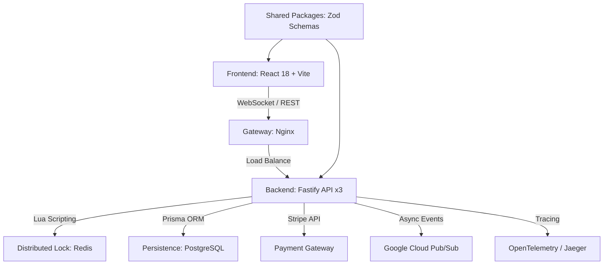

# 🏟️ Project MegaTicketing
> **High-Performance Industrial Ticketing Suite & Real-Time Logistics Monorepo**

[](https://github.com/genesisgzdev/Project-MegaTicketing/security/code-scanning)
[](docs/ARCHITECTURE.md)
[](https://github.com/genesisgzdev/Project-MegaTicketing)
[](LICENSE)
[](https://github.com/genesisgzdev/Project-MegaTicketing/actions/workflows/security.yml)

---

## 📖 Table of Contents
- [Executive Summary](#-executive-summary)
- [System Architecture](#-system-architecture)
- [Key Engineering Pillars](#-key-features--engineering-pillars)
- [Tech Stack & Tooling](#-tech-stack--tooling)
- [Security Hardening](#-security-hardening--integrity)
- [Infrastructure & Deployment](#-infrastructure--deployment)
- [Local Development](#-local-development)
- [Roadmap](#-roadmap)
- [Known Limitations](#-known-limitations)

---

## 🎯 Executive Summary
**Project MegaTicketing** is an enterprise-grade ticketing and seat management ecosystem designed for high-concurrency environments. This monorepo implements a **Distributed Locking Pattern** via Redis Lua scripting to handle millions of simultaneous reservation attempts with zero-overbooking guarantees and sub-millisecond consistency.

---

## 🏗 System Architecture
The repository follows a modern **Monorepo** structure managed by **Turbo**, ensuring atomic deployments and optimized build pipelines.



### Modules Breakdown:
- **`apps/api`**: High-performance backend built with **Fastify** and **TypeScript**.
- **`apps/web`**: Futuristic UI with Framer Motion, Tailwind CSS, and React Three Fiber for 3D seat mapping.
- **`packages/database`**: Centralized data layer with Prisma Client.
- **`packages/shared`**: Immutable type definitions and Zod validation schemas.

---

## 🚀 Key Features & Engineering Pillars

### 1. Atomic Transactionality (Redis + Lua)
We utilize custom Lua scripts executed directly within the Redis engine to ensure that the "Check-then-Set" logic for seat availability is truly atomic across distributed instances.

### 2. Distributed Tracing (OpenTelemetry)
Full observability via OpenTelemetry. Every request is traced across the Gateway, API, Redis, and Database, providing deep insights into system performance and bottleneck identification.

### 3. Asynchronous Order Processing
Integration with **Google Cloud Pub/Sub** ensures that seat reservations are fast and non-blocking. Downstream processes (billing, notification) are handled asynchronously.

---

## 🛠 Tech Stack & Tooling

- **Backend**: Fastify 5.x, WebSockets, Prisma, Redis, Stripe API, Google Cloud Pub/Sub.
- **Frontend**: React 18, Vite 5, Tailwind CSS 3, Framer Motion.
- **Observability**: OpenTelemetry, Jaeger, Prometheus, Grafana.
- **Database**: PostgreSQL (Production), SQLite (Development).
- **Quality**: Zod, Snyk, Autocannon, Playwright.

---

## 🔐 Security Hardening & Integrity

- **Cryptographic Standards**: JWT implementation using **`jose`** for robust JWS/JWE handling.
- **Advanced Fraud Detection**: Real-time velocity checks and pattern matching to prevent bot-driven bulk reservations.
- **Environment Strictness**: Boot-time validation of environment variables via Zod. Mandatory secrets in Docker Compose.
- **SAST/SCA**: Integrated **[Snyk](https://github.com/genesisgzdev/Project-MegaTicketing/security/code-scanning)** auditing in the development lifecycle via Git Hooks and CI/CD.
- **Vulnerability Shield**: Continuous monitoring using OSV-Scanner and automated dependency auditing.

---

## 🐳 Infrastructure & Deployment

### Docker Orchestration
The project includes a production-ready `docker-compose.yml` with:
- **PostgreSQL 16** persistence.
- **Redis 7** with health checks.
- **Jaeger** for trace visualization.
- Scaled **API replicas (3x)**.
- **Nginx Gateway** as a Load Balancer.
- **Frontend Web** service.

```bash
# Start the full stack (Ensure .env is configured)
docker compose up -d
```

### Cloud Infrastructure (Terraform)
Located in [`infra/`](./infra/), the Terraform plans provision:
- **GKE (Google Kubernetes Engine)** cluster.
- Managed Node Pools with auto-scaling.
- Workload Identity for secure GCP resource access.

Variables required: `project_id`, `region`.

---

## 🚦 Local Development

### Setup
1. **Clone and Configure**:
   ```bash
   git clone https://github.com/genesisgzdev/Project-MegaTicketing.git
   cd Project-MegaTicketing
   cp .env.example .env # Configure your secrets (JWT_SECRET & STRIPE_SECRET_KEY are mandatory)
   npm install --legacy-peer-deps
   ```

2. **Initialize Database**:
   ```bash
   npm run db:generate --prefix packages/database
   npx prisma db push --schema packages/database/prisma/schema.prisma
   ```

3. **Launch**:
   ```bash
   npm run dev
   ```

---

## 🗺 Roadmap
- [x] Implement Distributed Tracing with OpenTelemetry.
- [x] Integration with Google Cloud Pub/Sub for asynchronous order processing.
- [x] Advanced Fraud Detection module.
- [ ] Add support for Multi-Region Database Replication.
- [ ] Integration with Google Cloud Key Management Service (KMS).

---

## ⚠️ Known Limitations
- **Memory Usage**: High concurrency seat maps in React Three Fiber may be resource-intensive on low-end devices.
- **Stripe Webhooks**: Requires a local tunnel (e.g., Cloudflare Tunnel or ngrok) for local development testing.
- **Database Availability**: Current setup uses a single-instance PostgreSQL; multi-region replication is in the roadmap.

---
*Developed with technical integrity and anti-evasion mindset. Zero polling. Zero simulations.*
