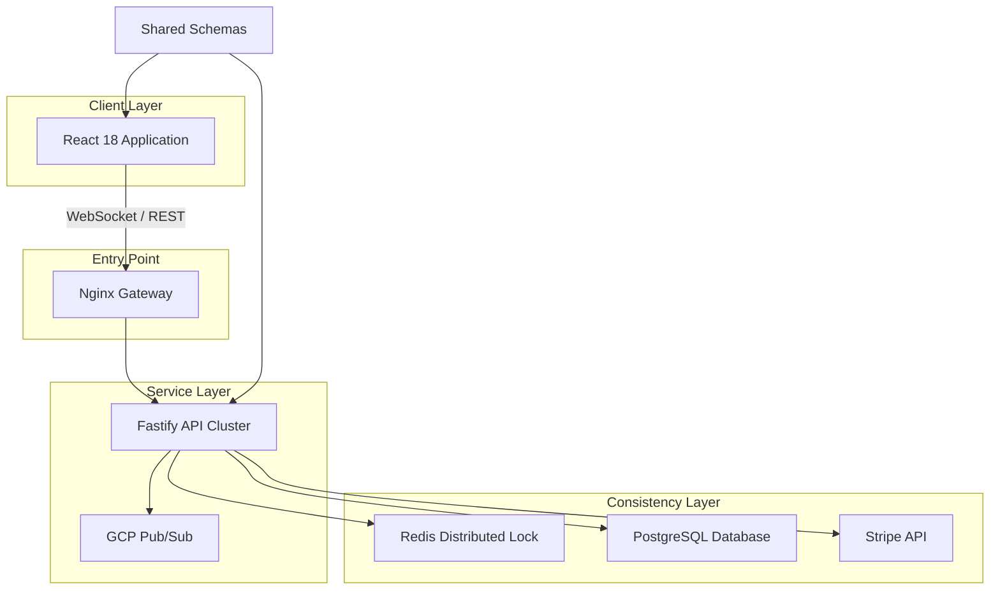

# MegaTicketing

Monorepo for high-concurrency event ticketing. Features distributed consistency and integrated security telemetry.

## System Architecture

The monorepo utilizes a shared-nothing backend design for horizontal scalability.



### Technical Implementation

- **Atomic State Transitions**: Custom Lua scripts in Redis enforce atomic logic for seat availability.
- **Type-Safe Schema Sharing**: Centralized Zod definitions ensure data integrity across the stack.
- **Security Interoperability**: Telemetry is structured for real-time correlation by the TDS EDR suite.
- **Infrastructure**: Multi-stage Docker builds and GKE deployment manifests.

## Technical Stack

- **Runtime**: Node.js 20
- **Backend**: Fastify, TypeScript, Prisma, Redis, Stripe.
- **Frontend**: React 18, Vite, Tailwind CSS.
- **DevOps**: Docker, Kubernetes (GKE), Terraform.

## Execution

### Local Development
```bash
npm install
npm run db:generate
npm run dev
```

### Containerized Environment
```bash
docker compose up -d --build
```

## Security and Audit
Audited via Snyk and OSV-Scanner pipelines. Incident reporting is integrated with GitHub Issues. Finalized April 6, 2026.
