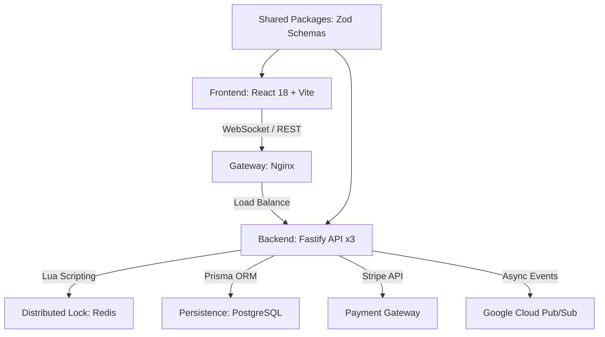

# MegaTicketing

High-availability ticketing monorepo designed for extreme concurrency and real-time consistency. Built with a decoupled microservices architecture and distributed locking.

## System Architecture

The monorepo is orchestrated by **Turbo** and utilizes a shared-nothing backend design for horizontal scalability.



### Engineering Pillars

-   **Atomic Transactionality (Redis + Lua)**: Reservation logic uses custom Lua scripts executed within the Redis engine. This guarantees that "Check-then-Set" operations for seat availability are truly atomic across distributed API replicas.
-   **Strong Type Safety**: Shared packages provide immutable Zod schemas and TypeScript interfaces to ensure data integrity from the database layer to the user interface.
-   **Security Hardening**: Implements `jose` for cryptographically sound JWT handling and strict environment validation via `config.ts` to prevent inconsistent boot states.
-   **Observability**: Integrated Prometheus instrumentation and structured JSON logging for real-time monitoring and SOC integration.

## Technical Stack

-   **Backend**: Fastify, TypeScript, Prisma, Redis, Stripe, GCP Pub/Sub.
-   **Frontend**: React 18, Vite, Tailwind CSS, Framer Motion.
-   **Infrastructure**: Docker, Kubernetes (GKE), Terraform.

## Deployment

### Local Environment
```bash
npm install
npm run db:generate
npm run dev
```

### Containerized Cluster
```bash
docker compose up -d --build
```

## Security Audit
This project is continuously scanned by **Snyk** and **OSV-Scanner**. Automated SOC reports are generated upon critical detection via integrated GitHub Action pipelines.
