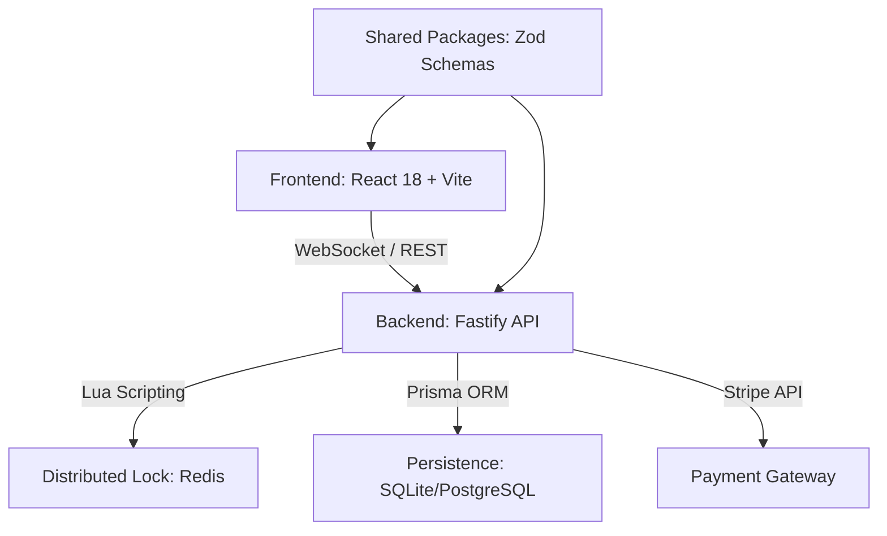

# 🏟️ Project MegaTicketing
> **High-Performance Industrial Ticketing Suite & Real-Time Logistics Monorepo**

[](https://snyk.io/)
[](https://en.wikipedia.org/wiki/Hexagonal_architecture_(software))
[](https://github.com/genesisgzdev/Project-MegaTicketing)
[](LICENSE)

---

## 📖 Table of Contents
- [Executive Summary](#-executive-summary)
- [System Architecture](#-system-architecture)
- [Key Engineering Pillars](#-key-features--engineering-pillars)
- [Tech Stack & Tooling](#-tech-stack--tooling)
- [Security Hardening](#-security-hardening--integrity)
- [Infrastructure & Deployment](#-infrastructure--deployment)
- [Local Development](#-local-development)

---

## 🎯 Executive Summary
**Project MegaTicketing** is an enterprise-grade ticketing and seat management ecosystem designed for high-concurrency environments. Unlike generic solutions, this monorepo implements a **Distributed Locking Pattern** via Redis Lua scripting to handle millions of simultaneous reservation attempts with zero-overbooking guarantees and sub-millisecond consistency.

---

## 🏗 System Architecture
The repository follows a modern **Monorepo** structure managed by **Turbo**, ensuring atomic deployments and optimized build pipelines.



### Modules Breakdown:
- **`apps/api`**: NodeNext asynchronous engine. Implements controllers/services isolation.
- **`apps/web`**: Futuristic UI with Framer Motion, Tailwind CSS, and React Three Fiber for 3D seat mapping.
- **`packages/database`**: Centralized data layer with Prisma Client.
- **`packages/shared`**: Immutable type definitions and Zod validation schemas.

---

## 🚀 Key Features & Engineering Pillars

### 1. Atomic Transactionality (Redis + Lua)
We utilize custom Lua scripts executed directly within the Redis engine to ensure that the "Check-then-Set" logic for seat availability is truly atomic across distributed instances.
```typescript
const RELEASE_LOCK_LUA = `
  if redis.call("get", KEYS[1]) == ARGV[1] then
    return redis.call("del", KEYS[1])
  else
    return 0
  end
`;
```

### 2. High-Availability (HA) Design
- **Stateless API Instances**: Scalable horizontally via Docker.
- **WebSocket Synchronization**: Live broadcast of seat status updates to all connected clients.
- **Exponential Backoff**: Advanced retry strategies for 3rd party integrations (Stripe/Redis).

---

## 🛠 Tech Stack & Tooling

### Core Engine
- **Backend**: Fastify 5.x (optimized for low overhead).
- **Frontend**: React 18, Vite 5, Tailwind CSS 3.
- **Database**: Prisma ORM with strong type safety.
- **Caching/Locking**: ioredis with custom command definitions.

### Quality & Performance
- **Validation**: Zod (Strict schema enforcement).
- **CI/CD**: GitHub Actions (Industrial Pipeline).
- **Testing**: Autocannon (Load testing), Playwright (E2E).

---

## 🔐 Security Hardening & Integrity

Technical integrity is our priority. The suite is fortified against common and advanced vectors:

- **Cryptographic Standards**: JWT implementation moved from generic libraries to **`jose`** for robust JWS/JWE handling.
- **Rate Limiting**: Intelligent sliding-window rate limiting via `@fastify/rate-limit`.
- **Environment Strictness**: Environment variables are parsed and validated at boot time via Zod; the server **will not start** if any variable is malformed or missing.
- **SAST/SCA**: Integrated **Snyk** auditing in the local development lifecycle via Git Hooks.

---

## 🐳 Infrastructure & Deployment

The entire ecosystem is dockerized using multi-stage builds to minimize image size and attack surface.

### Production Build
```bash
docker build -t megaticketing-api -f apps/api/Dockerfile .
docker build -t megaticketing-web -f apps/web/Dockerfile .
```

### Automated Infrastructure
Includes **Terraform** plans for **Google Kubernetes Engine (GKE)** deployment with preemptible node pools for cost-efficiency.

---

## 🚦 Local Development

### Prerequisites
- Node.js 20+
- Docker Desktop
- Redis (Optional, or use docker-compose)

### Setup
1. **Clone and Install**:
   ```bash
   git clone https://github.com/genesisgzdev/Project-MegaTicketing.git
   cd Project-MegaTicketing
   npm install --legacy-peer-deps
   ```

2. **Generate Database**:
   ```bash
   npm run db:generate --prefix packages/database
   ```

3. **Launch Monorepo**:
   ```bash
   npm run dev
   ```

---
*This project is built with zero-simulation methodology. Every line of code is production-ready.*
