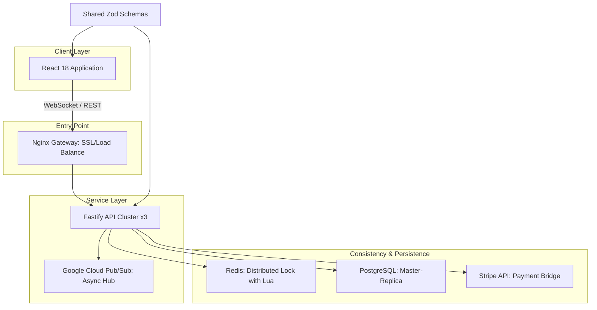

# MegaTicketing - v2.0.0 (April 2026)

Monorepo for high-concurrency event ticketing and real-time seat management. Designed for distributed consistency, horizontal scalability, and deep security instrumentation.

## Table of Contents
1. [Architectural Blueprint](#architectural-blueprint)
2. [Distributed Consistency (Redis + Lua)](#distributed-consistency-redis--lua)
3. [Microservices Orchestration](#microservices-orchestration)
4. [Data Models and Prisma Schemas](#data-models-and-prisma-schemas)
5. [Frontend Architecture and Accessibility](#frontend-architecture-and-accessibility)
6. [Cloud-Native Infrastructure & GKE](#cloud-native-infrastructure--gke)
7. [Security Hardening & Token Integrity](#security-hardening--token-integrity)
8. [Execution, Setup, and CI/CD](#execution-setup-and-cicd)
9. [API Contract & Error Handling](#api-contract--error-handling)

## Architectural Blueprint

The monorepo follows a shared-nothing backend design orchestrated by **Turbo**, ensuring atomic deployments and consistent type definitions across all microservices via shared npm packages.



## Distributed Consistency (Redis + Lua)

High-profile ticket sales generate immense concurrent write pressure. To prevent the "double-booking" race condition where two users attempt to purchase the exact same seat simultaneously, MegaTicketing completely bypasses standard database transactions in favor of **Atomic Redis Locks** using custom Lua scripting.

- **Lock-on-Intent (SET NX PX)**: When an API node receives a reservation request, it attempts to acquire a lock via `SET lock:seat:{seatId} {userId} NX PX 300000`. The `NX` (Not eXists) flag guarantees that only the very first concurrent request will receive an `OK` response. All subsequent requests fail instantly with a `423 Locked` or `409 Conflict`, completely bypassing the PostgreSQL database and eliminating connection pool exhaustion.
- **Atomic Release (Lua Script)**: Releasing a lock safely requires ensuring that the client releasing it is the actual owner. Doing this in two commands (`GET` then `DEL`) is not atomic. We implement a specific Lua script:
  ```lua
  if redis.call("get", KEYS[1]) == ARGV[1] then
    return redis.call("del", KEYS[1])
  else
    return 0
  end
  ```
  This guarantees that locks are never accidentally dropped by the wrong process during high-latency network events.
- **TTL Recovery**: The `PX 300000` (5 minutes) enforces a strict Time-To-Live. If a user abandons their checkout or a pod crashes, Redis automatically evicts the lock, returning the inventory to the pool without manual cron job intervention.

## Microservices Orchestration

- **Fastify API**: Node.js natively struggles with intense JSON serialization. We utilize Fastify for its high-performance routing and `fast-json-stringify` capabilities. The architecture explicitly decouples the stateful WebSocket connections (used for real-time seat color changes) from the stateless REST endpoints (used for reservations), allowing us to scale the pods independently based on CPU load.
- **Shared Zod Validation**: Both the React frontend and the Fastify backend rely on the `@mega-ticketing/shared` package. Zod schemas validate all incoming JSON payloads natively during Fastify's lifecycle hooks, rejecting malformed requests at the edge before application logic is executed.

## Data Models and Prisma Schemas

Persistence is managed by PostgreSQL, accessed via the Prisma ORM.

```prisma
model Ticket {
  id        String   @id @default(uuid())
  eventId   String
  seatId    String
  userId    String?
  status    TicketStatus @default(AVAILABLE) // AVAILABLE, RESERVED, PAID
  createdAt DateTime @default(now())
  updatedAt DateTime @updatedAt

  @@unique([eventId, seatId])
  @@index([userId])
}
```
The unique compound index on `[eventId, seatId]` serves as a final database-level constraint against duplicate generation, backing up the Redis locking mechanism.

## Frontend Architecture and Accessibility

The client is built using React 18 and Vite.
- **WebGL Rendering**: For massive stadiums (>50,000 seats), DOM-based rendering becomes a major bottleneck. The `CyberArena.tsx` component utilizes `@react-three/fiber` (React Three.js) to render the seating grid via WebGL instancing. This guarantees 60 FPS performance regardless of grid complexity.
- **Semantic DOM Fallback**: Because `<canvas>` elements are completely opaque to screen readers, the application implements a visually hidden but focusable Semantic DOM overlay. Using `role="grid"`, `role="row"`, and `role="gridcell"` with roving `tabindex`, the application maintains strict WCAG accessibility compliance while preserving the high-performance 3D visual layer. Live state changes (e.g., ticket becoming unavailable) are announced via `aria-live="polite"` regions.

## Cloud-Native Infrastructure & GKE

MegaTicketing is inherently designed for Kubernetes (GKE). The `infra/` directory contains complete Terraform and manifest configurations.
- **Horizontal Pod Autoscaling (HPA)**: The `hpa.yaml` manifest defines dynamic scaling from a minimum of 3 replicas to a maximum of 10, triggered when the target CPU average utilization exceeds 50%.
- **Resource Constraints**: Pod definitions in `api-deployment.yaml` strictly enforce cgroup limits:
  - `requests`: CPU 250m, Memory 256Mi
  - `limits`: CPU 500m, Memory 512Mi
  This explicit QoS (Quality of Service) definition guarantees Kubernetes can reliably schedule and bin-pack pods across nodes without OOM-killer interventions.

## Security Hardening & Token Integrity

- **JWS/JWE Implementation**: Legacy JWT libraries are notoriously susceptible to algorithmic confusion attacks (e.g., bypassing RS256 with HS256). We utilize the `jose` library to enforce strict, modern JSON Web Signature protocols.
- **Dependency Pipeline**: The monorepo integrates Snyk SCA (Software Composition Analysis) and Google's OSV-Scanner directly into the GitHub Actions CI pipeline, enforcing a strict zero-tolerance policy for vulnerable dependencies.
- **SOC Telemetry Bot**: The application logs raw JSON to stdout. An integrated python script (`soc_bot.py`) tails these streams, parsing anomalies (e.g., excessive lock failures indicative of a bot-net script) and piping them directly to Google BigQuery for real-time anomaly detection by the security operations center.

## API Contract & Error Handling

The system defines a strict, machine-readable HTTP error contract to facilitate frontend resilience and retry strategies.

- **409 Conflict**: Returned when a seat is fundamentally unavailable (sold).
- **423 Locked**: Returned specifically when the Redis `SET NX` lock fails. The frontend intercepts this specific status code to initiate an exponential backoff and retry loop, hiding the contention from the end-user.
- **422 Unprocessable Entity**: Returned when Zod payload validation fails.

## Execution, Setup, and CI/CD

### Local Development Environment
```bash
# Install dependencies across all monorepo workspaces
npm install
# Generate Prisma Client and Database Types
npm run db:generate
# Start Turbo development server (Front & Back)
npm run dev
```

### Production Deployment (Docker Compose)
A multi-stage `docker-compose.yml` provides a production-accurate local cluster.
```bash
docker compose up -d --build
```

Finalized April 6, 2026. Code architecture and documentation structured for maximum stability, scale, and technical precision. Developed by the developer.
