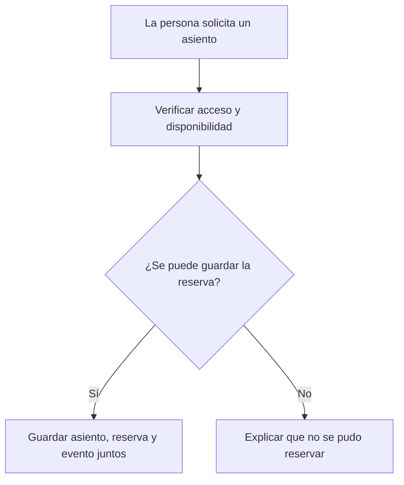
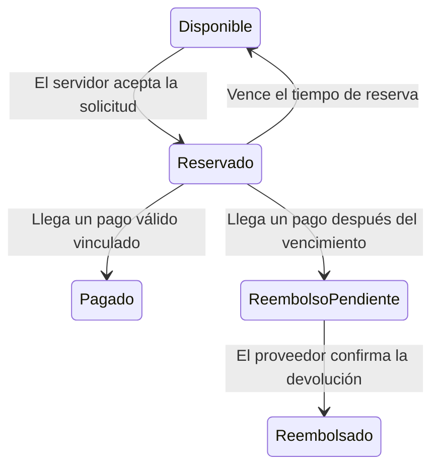

# Cómo se confirma un asiento

La web muestra opciones. El servidor comprueba el acceso y la base de datos decide si una reserva puede guardarse. Cambiar un color en la pantalla nunca cambia el estado de una venta.

## Reserva y disponibilidad

La lista de eventos se consulta completa siguiendo la paginación. Los asientos se actualizan cada cinco segundos. La web permite buscar, quitar asientos y sumar importes por moneda. Una actualización retira de la selección los asientos que ya no están disponibles.

`GET /session` verifica el acceso del organizador. El navegador guarda temporalmente ese acceso en memoria y utiliza la identidad devuelta por el servidor. La firma, el vencimiento y la identidad se vuelven a comprobar al reservar. En producción se comprueban además emisor y audiencia.

Cada asiento se solicita por separado. La pantalla informa resultados parciales y no presenta un grupo como una reserva indivisible. Durante el envío impide cambios de evento y nuevos clics de reserva. Un reintento tras una respuesta incierta conserva su clave de solicitud.

## Dos personas pueden elegir el mismo asiento

Redis coordina las solicitudes que compiten mediante un bloqueo temporal. PostgreSQL conserva la decisión dentro de una transacción: comprueba el asiento, guarda la reserva y registra el evento pendiente de publicación.

La base impone un ticket por asiento y un número único de asiento dentro de cada evento. Si la transacción falla, se intenta liberar únicamente el bloqueo que pertenece a esa solicitud. Redis no sustituye esas restricciones de base de datos.

La idempotencia reconoce una solicitud repetida por su clave, contenido e identidad. Reutilizar la misma clave para otro contenido o acceso produce un conflicto. Así un reintento no reutiliza por accidente la autorización de otra persona.

## Una reserva todavía no es un pago

El precio y la moneda pertenecen al asiento guardado. La API crea una intención de pago y la vincula a una generación concreta de reserva. Un cliente no puede cambiar la moneda para reinterpretar el importe.

El aviso firmado de Stripe comprueba pago, importe, moneda e identidad de la reserva antes de marcarla como pagada. Un pago tardío no se asigna al siguiente comprador del asiento. `PaymentAttempt` conserva la identidad anterior y permite reintentar el reembolso con una clave estable.

Los avisos ya procesados se registran en PostgreSQL. Las entregas repetidas no vuelven a cobrar ni convierten una reserva cancelada en pagada. La confirmación del reembolso se copia al ticket actual solo si todavía corresponde a ese pago.

La pantalla de este repositorio confirma reservas, pero todavía no integra el formulario de pago ni emite entradas. Esas acciones necesitan conectarse al contrato del servidor.

## Publicar lo ocurrido sin perder la transacción

El evento de reserva se guarda con el ticket en una tabla de pendientes, llamada outbox. Un publicador reclama filas con una concesión temporal y las envía a Redis Streams. Otra réplica puede recuperar una concesión vencida.

Puede producirse una entrega duplicada si el proceso se interrumpe después de publicar y antes de marcar la fila. El consumidor registra `outboxId` en `ProcessedOrderEvent` antes de confirmar. Ese consumidor registra eventos; no envía entradas, correos ni liquida pagos.

## Encontrar cada responsabilidad

| Archivo o carpeta | Qué contiene |
| --- | --- |
| `apps/web/src/CyberArena.tsx` | Catálogo, selección, acceso y reserva |
| `apps/api/src/auth.ts` | Verificación de la identidad firmada |
| `apps/api/src/controllers` | Contratos de cada petición |
| `apps/api/src/services/reservation.service.ts` | Reserva persistida y asociación del pago |
| `packages/database/prisma` | Tablas, restricciones y migraciones |
| `apps/api/src/services/pubsub.service.ts` | Publicación y consumo de eventos |
| `infra` | Configuración de despliegue |

`/health/live` indica que el proceso responde. `/health/ready` comprueba PostgreSQL y Redis. La pantalla del comprador evita presentar métricas internas como si fueran parte de elegir una entrada.

CI ejecuta compilación, auditoría de dependencias y pruebas web y de API. Las integraciones usan PostgreSQL y Redis reales y comprueban carreras, pagos tardíos e idempotencia. Las pruebas con sustitutos del proveedor verifican contratos y no realizan cobros externos. Los archivos de infraestructura se validan, pero eso no demuestra que exista una instalación pública.

[Guía de uso](USO.md) · [Preparar el despliegue](DEPLOYMENT_PREFLIGHT.md) · [Mapa de archivos](REPOSITORY_MAP.md)
